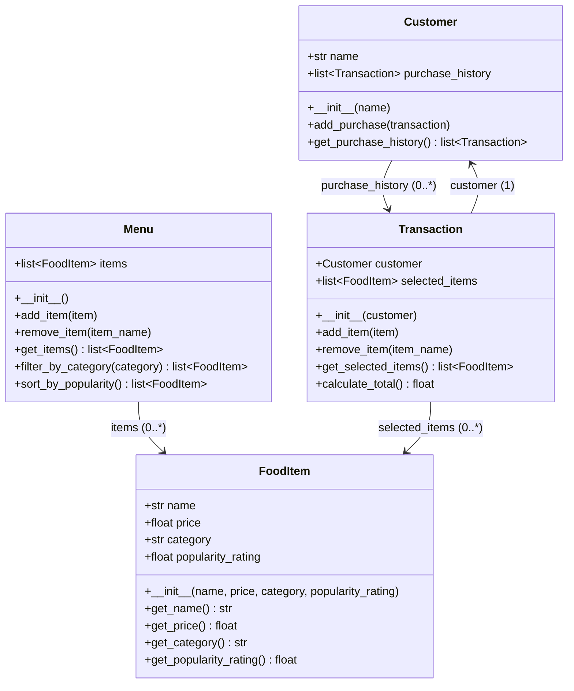

# ByteBites UML Class Diagram

The final Mermaid source is [bytebites_design.mmd](bytebites_design.mmd).
It follows `bytebites_spec.md` and `ByteBites_Design_Reference.md`, and the
class names, public attributes, and methods match `models.py`.

The original, unreviewed AI output remains in
[draft_from_copilot.mmd](draft_from_copilot.mmd) for comparison. Its
`isVerifiedUser()` method adds authentication behavior outside the reference
file's scope; the final design excludes it.

## Final diagram

The preview below contains the same Mermaid source as `bytebites_design.mmd`.



## Class Summary

| Class | Responsibility |
| --- | --- |
| `Customer` | Stores a customer's name and past purchase history. |
| `FoodItem` | Represents one menu item with name, price, category, and popularity rating. |
| `Menu` | Stores available food items, filters by category, and sorts by popularity. |
| `Transaction` | Groups selected food items for a customer and calculates their total cost. |

## Verified design decisions

- Use `Transaction` for the single purchase described by the spec. Keep its
  selected items separate from the full menu catalog.
- Use has-a associations. A food item is not a kind of menu, and a transaction
  is not a kind of customer. The arrows describe object references without
  asserting exclusive ownership or object lifetime rules.
- Match Python's snake_case names and public attributes. The first draft used
  camelCase names and private markers that do not describe `models.py`.
- Include `Menu.sort_by_popularity()`. It returns a new list ordered from
  highest to lowest popularity; it does not reorder `Menu.items` in place.
- Allow zero selected items in a transaction. `calculate_total()` sums the
  prices and returns zero for an empty list, as the empty-total test requires.
  The diagram's numeric return annotation describes the price total; Python's
  empty `sum()` returns the integer `0`, numerically equal to `0.0`.
- Keep purchase history explicit: creating a transaction does not automatically
  add it to a customer's history. The caller uses `Customer.add_purchase()`.
- Do not add authentication, database, payment, or unrelated backend features.

## Verify the implementation

From this repository folder, with Python and pytest available:

```text
python -B models.py
python -B -m pytest -p no:cacheprovider -q
```

The sample scenario filters Desserts, sorts popularity scores from 4.8 to 4.6
to 4.2, and prints an order total of $11.00. The six existing tests cover
matching and missing categories, descending and empty sorting, a multi-item
total, and an empty total. They do not verify every possible input contract.
