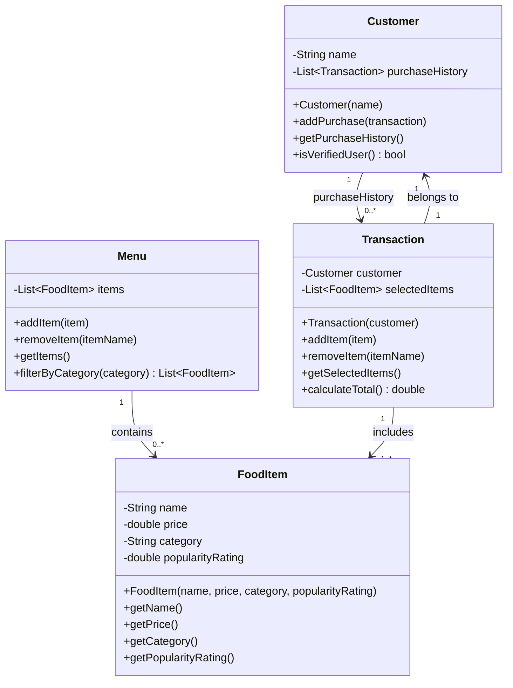

# ByteBites UML Class Diagram

## Class Summary

| Class | Responsibility |
| --- | --- |
| `Customer` | Stores customer identity and purchase history so the app can verify real users. |
| `FoodItem` | Represents one menu item with name, price, category, and popularity rating. |
| `Menu` | Manages the collection of available food items and supports category filtering. |
| `Transaction` | Groups selected food items for a customer and calculates the total cost. |
